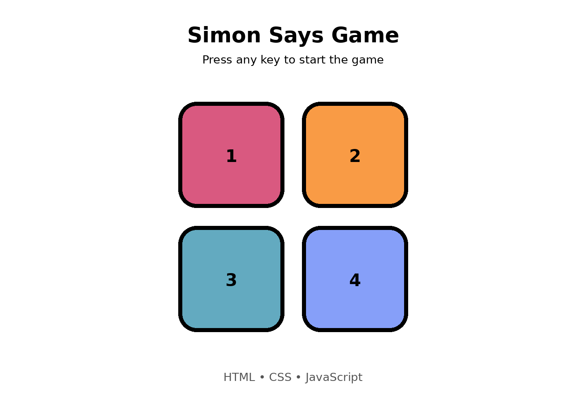

# 🎮 Simon Says Game

A browser-based **Simon Says memory game** built using **HTML, CSS, and JavaScript**.

The game tests the player's memory by showing a sequence of colored buttons. The player must remember and reproduce the sequence correctly. Each successful round increases the difficulty by adding another color to the sequence.

## 🚀 Live Demo

👉 Add your GitHub Pages link here after deployment.

## 📸 Preview

Add a screenshot or GIF of the game here.

```text

```

## 🛠️ Technologies Used

* HTML5
* CSS3
* JavaScript
* DOM Manipulation
* Event Listeners
* JavaScript Arrays
* setTimeout()

## 🎯 Features

* 🎮 Interactive Simon Says gameplay
* 🎨 Four colored buttons
* 🔀 Random color sequence generation
* 📈 Increasing difficulty with each level
* 🧠 Memory-based gameplay
* ✨ Button flash animations
* ❌ Game-over detection
* 🔄 Restart functionality
* 📊 Level/score tracking

## 🕹️ How to Play

1. Open the game in your browser.
2. Press any keyboard key to start.
3. Watch which button flashes.
4. Click the button that flashed.
5. In the next level, remember the previous sequence and the new button.
6. Repeat the complete sequence correctly.
7. One wrong click ends the game.
8. Press any key to start a new game.

## 📂 Project Structure

```text
simon-says-game/
│
├── index.html
├── style2.css
├── simon.js
├── screenshot.png
└── README.md
```

## 🧠 How the Game Works

The game maintains two arrays:

### Game Sequence

```javascript
let gamseq = [];
```

This stores the sequence generated by the game.

### User Sequence

```javascript
let userseq = [];
```

This stores the buttons clicked by the player.

The game compares both sequences to determine whether the player's answer is correct.

```text
Game generates color
        ↓
Button flashes
        ↓
Player clicks button
        ↓
Store user's answer
        ↓
Compare with game sequence
        ↓
   ┌─────────────┐
   │             │
 Correct       Wrong
   │             │
   ↓             ↓
Next level    Game Over
```

## 📚 What I Learned

While building this project, I practiced:

* Selecting HTML elements using `querySelector()`
* Handling keyboard and mouse events
* Adding and removing CSS classes with `classList`
* Working with arrays
* Generating random values
* Using functions to organize JavaScript code
* Using `setTimeout()` for animations and delays
* Managing game state
* Implementing game-over and restart logic

## 🔮 Future Improvements

Some features I may add later:

* 🔊 Sound effects
* 🏆 High-score tracking
* 📱 Better mobile responsiveness
* 🎵 Different sounds for each button
* 💾 Saving high scores using Local Storage
* 🌙 Dark mode
* ⏱️ Timer/challenge mode

## 👨‍💻 Author

**Aman Kumar**

Built as a JavaScript learning project while practicing DOM manipulation, events, arrays, and game logic.

---

⭐ If you like this project, consider giving the repository a star!
